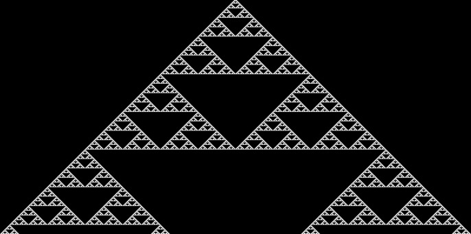

# 1D-Life

This is an implementation of Wolfram's [Rule
126](http://mathworld.wolfram.com/Rule126.html).

You'll need to complete the `getNewVal()` function in `1d-life.js`.

This is a standalone, vanilla (non-React) web page. You should be
able to open the `index.html` file in your browser and see the
result. (Before you complete your implementation, the image should
show as all black).

If there are issues opening the `index.html` file directly, you can
also run a Python web browser on port 8000 from the command line:

```
cd 1d-life/src
python -m SimpleHTTPServer
```

Then navigate to `http://localhost:8000` to see the app.


## What is 1D Life?

In the Game of Life, we used a 2D grid to store the cellular automaton.
In 1D life, it's a simple 1D array.

Each "generation", the array is examined and new values for each cell
are computed based on the values of that cell and its surrounding
cells.

Usually the subsequent generations are displayed on the next row of a
bitmap. Generation 0 is shown on row 0, generation 1 on row 1, and so
on.

## Algorithm

Everything is written for you except the code in `getNewVal()`. This
function accepts a 1D array of the current life status, and an `x`
coordinate into that array.

It should return `0` if the cell at that `x` should become dead, and
should return `1` if it should be alive next generation.

Whether or not the cell should remain alive or die depends on the
results of the calculation of [Rule 126](#rule-126), that you will
implement, below.

The remaining, existing code sets up a canvas, loops through the
generations, manages the double-buffered life status, etc.

## Rule 126

This rule describes how cells live and die based on their own values,
and that of their immediate neighbors.

For example, if a cell is dead, and its immediate neighbors are alive,
that pattern of 3 cells is:

```
#.#
```

For any of 8 possible combinations of 3 cells surrounding and
including a cell at an _x_ coordinate, we produce a new single cell
at that _x_ coordinate as given by the following table (`.` is 0, `x`
is 1):

```
...  ..#  .#.  .##  #..  #.#  ##.  ###     <- this pattern
 .    #    #    #    #    #    #    .      <- produces this result
```

The final output should look like this:



This result is a [Sierpinski
Triangle](https://en.wikipedia.org/wiki/Sierpinski_triangle), a
[fractal](https://en.wikipedia.org/wiki/Fractal) that has a habit of
turning up in surprising places.
